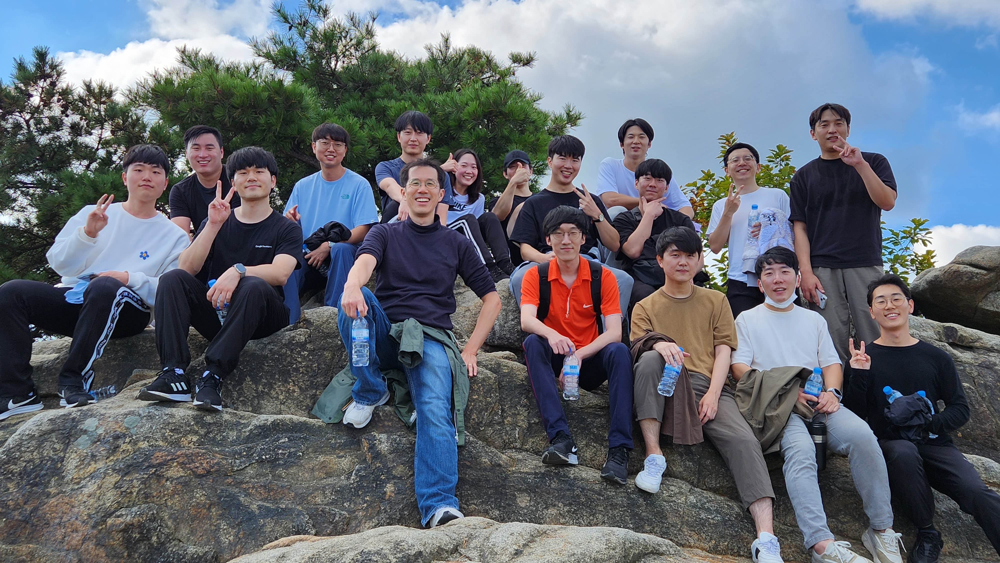

(@ Gwanak Mt., Oct 2022)

<!--**We recently moved to [Seoul National University ECE](https://ee.snu.ac.kr) as of March 01, 2021!**-->

Welcome to **M.IN.D Lab** at **Seoul National University**! 

Our mission is to develop state-of-the-art machine learning/deep learning algorithms for solving **intelligence** and **real world data problems**. To know more about our research and joining the lab, please visit [**here**](projects/project) and [**here**](people/joinus.md), respectively.

<!-- To know more about the lab, you may read this [**feature**](https://webzine.skku.edu/skkuzine/section/culture03.do?articleNo=76954&pager.offset=0&pagerLimit=10) written while we were at SKKU (in Korean).     -->

**Notice:** As of **May 2022**, we do **not** have any more openings for _Summer/Fall 2022_ BS internship. For the **_Winter/Spring 2023_** BS internships, we will post on the website around **_Nov 2022_**. Thanks for your interest!!

<!-- we currently have about 1~2 openings for the BS interns for **_Summer/Fall 2022_**. For those who are interested, please e-mail [Prof. Taesup Moon](people/pi.md) with your **transcript & CV**, and we will get back to you.  -->

<!-- do _**not**_ have any more openings for BS interns or MS/PhD positions for Winter/Spring 2022. For the **_Summer/Fall 2022 openings_**, we will post on the website around **May 2022**. Thanks for your interest!
 -->
<!--
Following is our lab intro video taken in 2018 (special thanks to Karel Setnička)! 
<iframe src="https://player.vimeo.com/video/257239184" width="640" height="360" frameborder="0" webkitallowfullscreen mozallowfullscreen allowfullscreen></iframe>
-->

### Recent News

- 22.9 One paper got accepted to [**_NeurIPS 2022_**](https://neurips.cc/)! Congratulations Hongjoon!
- 22.7 Seyoung, Yongho, Sumin, and Jinwoo joined the lab as summer BS interns! Welcome!
- 22.7 Hyunwoong will join the lab as an MS/PhD student this Fall! Welcome!
- 22.7 Jaeseok won the prestigeous [**SBS 문화재단 Scholarship for Graduate Students**](https://foundation.sbs.co.kr/culture.cmd?act=agendaFutureHumanGuideline)! Congrats!!
- 22.7, Sungmin and Hongjoon won the prestigeous [**율촌 AI STAR Award 2022**](http://www.aitimes.kr/news/articleView.html?idxno=25525)! Congrats!!
- 22.7, One paper got accepted to [**_ECCV 2022_**](https://eccv2022.ecva.net/)! Congrats Jaeseok and Taebaek!
- 22.6, Jaeseok won the "Stars of Tomorrow Award of Excellence" for his internship at MSRA. Congrats!
- 22.6, 9 lab members attended [**_CVPR 2022_**](https://cvpr2022.thecvf.com/)! 
- 22.4, One paper got accepted to [CVPR 2022 Workshop on Continual Learning](https://sites.google.com/view/clvision2022). Congrats Sungmin!
- 22.3, [One paper](https://arxiv.org/abs/2111.14581) got accepted to [**_CVPR 2022_**](https://cvpr2022.thecvf.com/). Congratulations Sangwon!  
- 22.1, Dohoon, Seokhyun, and Taebaek will join the lab as MS/PhD students from March! Juhyun, Youngin, Heewoong, Donguk joined the lab as BS interns! Welcome!   

