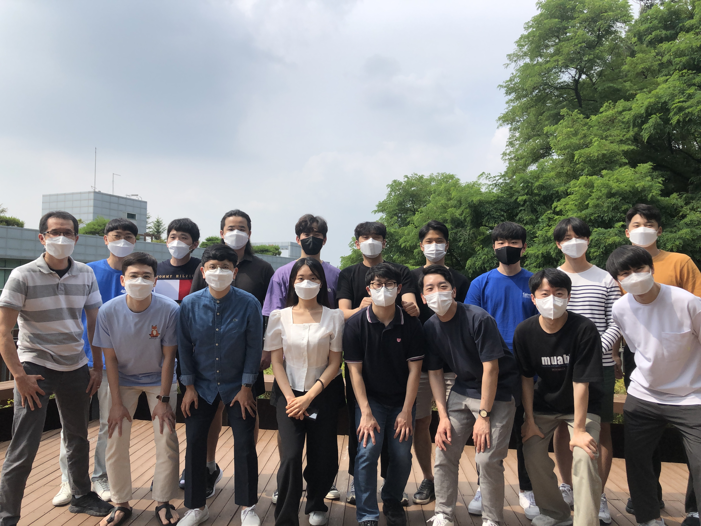

<!--**We recently moved to [Seoul National University ECE](https://ee.snu.ac.kr) as of March 01, 2021!**-->

Welcome to **M.IN.D Lab** at **Seoul National University**! 

Our mission is to develop state-of-the-art machine learning/deep learning algorithms for solving **intelligence** and **real world data problems**. For more information on research topics, please visit our [project page](projects/project). To know more about the lab, you may read this [**feature**](https://webzine.skku.edu/skkuzine/section/culture03.do?articleNo=76954&pager.offset=0&pagerLimit=10) written while we were at SKKU (in Korean).    

To know more about joining the lab, please read this [*info*](info.md) and e-mail [Prof. Taesup Moon](people/pi.md) with your **transcript & CV**.

<!--
Following is our lab intro video taken in 2018 (special thanks to Karel Setnička)! 
<iframe src="https://player.vimeo.com/video/257239184" width="640" height="360" frameborder="0" webkitallowfullscreen mozallowfullscreen allowfullscreen></iframe>
-->

### Recent News

- 21.7 One paper got accepted to [**ICCV 21**](http://iccv2021.thecvf.com/home)! Congratulations Hongjoon Ahn and Jihwan Kwak!
- 21.7 Three members will do industry internships in the fall! Congratulations Hongjoon Ahn ([Amazon Shanghai](https://www.amazon.jobs/en-gb/locations/shanghai-china)), Jaeseok Byun ([Microsoft Research Asia](https://www.microsoft.com/en-us/research/lab/microsoft-research-asia/)), and Sangwon Jung ([Naver AI](https://clova.ai/ko))!
- 21.7 Sungmin Cha got the Best Paper Award at [CKAIA summer conference](http://aiassociation.kr/Conference/ConferenceView.asp?AC=0&CODE=CC20210401&CpPage=111#CONF).
- 21.7 Taesup served as a General Chair for the CKAIA summer conference.
- 21.5 M.IN.D Lab will participate in [**Naver-SNU Hyperscal AI Project**](http://www.aitimes.kr/news/articleView.html?idxno=20983)!
- 21.4 Our lab will be supported by [**NRF 미래뇌융합기술 연구과제**]()!
- 21.4 Our lab will be supported by [**Microsoft-IITP Project**]()!
- 21.3 We moved to [**Seoul National University ECE**](http://ee.snu.ac.kr) as of March 01, 2021!
- 21.3 Two papers got accepted to [**CVPR 21**](http://cvpr2021.thecvf.com/)! Congratulations Sungmin, Jaeseok, Sangwon, Donggyu, and Taeeon!
- 21.3 Two papers got accepted to [**ICLR 21**](https://iclr.cc/)! Congratulations Sungmin and Taeeon!
- 21.3 Our lab will be supported by [**NRF Mid-Career Research Program**](https://www.nrf.re.kr/biz/info/notice/list?menu_no=378&biz_no=85) for 5 years!
- 20.11 Sungmin won the Best Paper Award at [**2020 Microsoft-AI Association Fall Conference**]()! Congratulations!
- 20.12 Sangwon, Hongjoon won the [**Qualcomm Innovation Fellowship Korea**]()! Congratulations!
